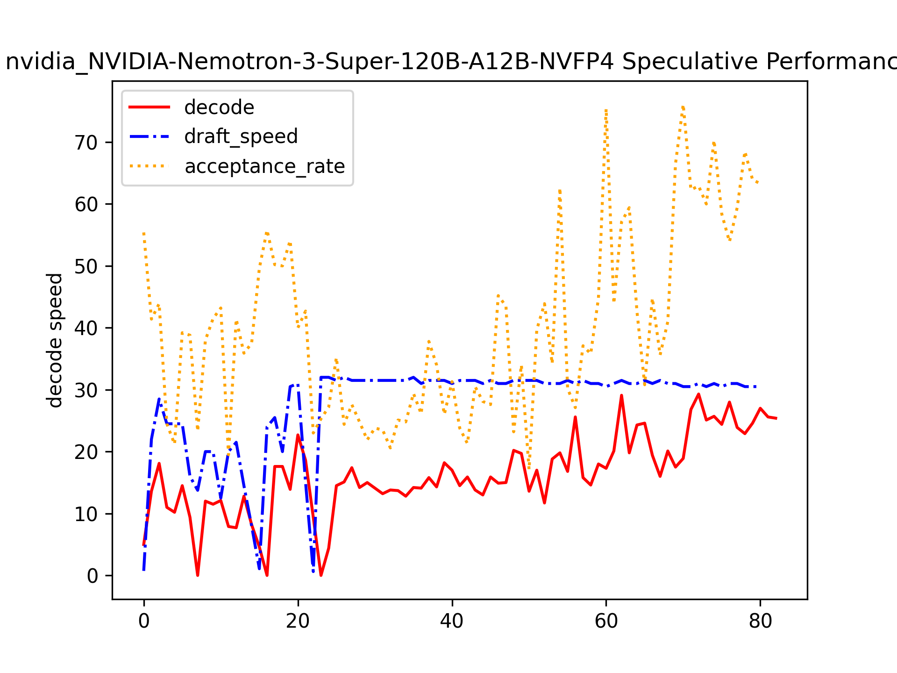

# VLLM Performance Analyser
A automated script that extract key performance metrics from vllm serving logs.

## Quick Start
```
git clone https://github.com/AnaOnTram/vllm_analyser.git #clone the directory
cd vllm_analyser
```
Copy your vllm log and save it a txt file. 
```
python log_analysis.py #for vLLM
```
Or for multi-engine support
```
python engine.py --file examples/sample_log.txt --engine 0 #vLLM
#or
python engine.py --file examples/log_sglang.txt --engine 1 #SGLang
```
Available arguements
```python
options:
  -h, --help            show this help message and exit
  -f, --file FILE       Path to the log file
  -e, --engine {0,1,2}  0 for vllm, 1 for sglang, 2 for llama.cpp
```

## Sample Outputs
1. basic statistics
```bash
Inference Engine Selected: sglang
Served Model: Qwen_Qwen3.6-35B-A3B-FP8
-------------------------Basic-------------------------
Peak Prefill Speed is: 6578.13 tokens/second
Minimum Prefill Speed is: 0.07 tokens/second
Average Prefill Speed is: 1889.89 tokens/second
95th percentile of Prefill Speed is: 5927.98 tokens/second
Peak Decode Speed is: 95.44 tokens/second
Minimum Deocde Speed is: 0.05 tokens/second
Average Decode Speed is: 42.44 tokens/second
95th percentile of Docode Speed is: 72.93 tokens/second
-------------------------MTP-------------------------
Peak accept rate is: 52.00%
Minimum accept rate is: 7.00%
Average accept rate is: 23.01 %
95th percentile of accept rates is: 42.90%
Try reduce your number of draft tokens to avoid overhead!
```
2. Line Chart


3. [Sorted csv](Assets/nvidia_NVIDIA-Nemotron-3-Super-120B-A12B-NVFP4_performance.csv)

## Model inference engine support
- [x] vllm
- [x] sglang
- [ ] llama.cpp
